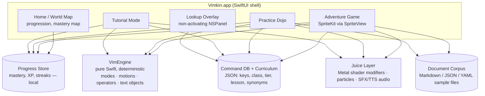
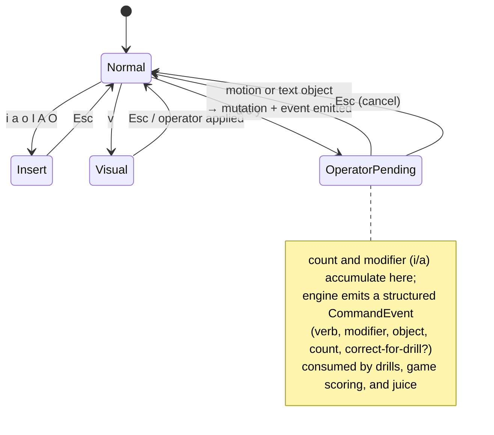

# feat: Vimkin — a free macOS game that makes learning Vim joyful

**Target repo:** `vimkin` (greenfield; to be created as `RooseveltAdvisors/vimkin`). All paths below are relative to that repo. Reference code: the `vimhint` fork (harvest-only, not a base).

---

## Summary

Build **Vimkin**, a free, open-source, native macOS app that teaches Vim motions through an original, visually rich game: a tutorial track teaches keystrokes with accuracy-first drills, a practice dojo builds muscle memory on real Markdown/JSON/YAML documents, and a skill-gated adventure game — you are a cursor-spirit rescuing creatures called *Vimkins* trapped inside wild documents — makes only the motions you've learned available, level by level.

---

## Problem Frame

Learning Vim has a brutal early curve: mode confusion, cognitive overload from command lists, and a mid-learning productivity dip where most people quit — right before the "grammar click" (verb + modifier + text-object composability) that makes Vim feel like magic. Existing tools each cover one slice: vimtutor is dry and linear, VIM Adventures is paid/browser-only and drifts into logic puzzles, keybr-style adaptive drills aren't fun, and nothing targets non-coders who mostly edit Markdown, JSON, and YAML. There is no free, native, genuinely *fun* Mac app that carries a learner from zero to grammar fluency. Jon also wants this as a mission piece: in an AI-first world the terminal is the leverage surface, and more people should get to enjoy it.

---

## Requirements

- **R1** — Free to use; open-source repo; distributed as a DMG via GitHub Releases (no paywall, no accounts).
- **R2** — Game-first: an original adventure game where Vim motions are the only controls and new motions unlock as skill-gated progression. Mechanics may be genre-inspired (skill-gated unlocks); all expression — name, world, story, art, levels, characters — must be original.
- **R3** — Tutorial track that teaches keystrokes/motions progressively (survive → navigate → edit verbs → text-object grammar → advanced), with accuracy-before-speed drilling.
- **R4** — Real-file training: drills and game levels operate on realistic Markdown, JSON, and YAML documents (not just code), aimed at note-takers and normal people.
- **R5** — Visually rich native Mac experience: fluid animation, particles/shader "juice," sound design, polished chrome on current macOS.
- **R6** — In-app lookup reference (the vimhint role): summonable overlay with searchable command reference, including plain-English phrasing ("delete inside quotes").
- **R7** — Ethical gamification: XP/mastery/streaks that encourage daily practice without dark patterns (no loss-aversion spam, no manufactured scarcity).
- **R8** — Name + web presence: "Vimkin" branding; vimkin.com / vimkin.app registration (pending Jon's go on the ~$20-30/yr spend); landing page later.
- **R9** — AI-generated assets (character art, backgrounds, SFX/voice) produced via the fleet asset pipeline (firstmate on gpu for image/video; fleet Qwen3-TTS for voice), all original IP.

---

## Key Technical Decisions

1. **Name: Vimkin.** "Vimble" was rejected after research found a live App Store app (Vimble AI Video Generator) and the Feiyu-Tech "Vimble" gimbal line — same-platform confusion risk. "Vimkin" has vimkin.com + vimkin.app unregistered, no App Store or meaningful GitHub collisions, and doubles as in-game IP (the Vimkin creatures). Trademark posture: distinctive coined word; avoid "Adventures" in any tagline; never reuse VIM Adventures proper nouns.

2. **Stack: SwiftUI shell + SpriteKit game scenes (hybrid), zero third-party dependencies.** Research confirms this is the current recommended split: SwiftUI owns chrome (menus, progression, settings, HUD), SpriteKit owns gameplay scenes via `SpriteView`. SwiftUI-native Metal shader modifiers (`.colorEffect`/`.distortionEffect`/`.layerEffect`, macOS 14+) supply juice without leaving SwiftUI. Deployment target **macOS 15.0** (matches reference code; Liquid Glass chrome adopted availability-gated when built against the macOS 26 SDK — chrome only, not in-game). Third-party engines (Godot etc.) rejected: packaging complexity, no payoff for a Mac-only 2D game.

3. **The core is a pure-Swift Vim engine (`VimEngine`), shared by tutorial, dojo, and game.** A deterministic, UI-free modal-editing model (buffer + cursor + modes + motions + operators + text objects + registers + counts + undo) with an event-in/state-out API. This is the single source of truth for "did the player execute `diw` correctly" everywhere in the app. It is the highest-risk unit and gets the deepest test suite. Scope is a curriculum-driven subset of Vim, grown milestone by milestone — never "implement all of Vim."

4. **Curriculum = the Vim grammar, encoded as data.** The verb+modifier+text-object model (the community-consensus teaching frame) is the spine. A one-command-per-record JSON database (keys, mode, class: motion/operator/text-object/action, difficulty tier, lesson, plain-English synonyms) drives lessons, drills, game unlocks, and lookup search alike. Seed content: vimhint's curated 14-category/~110-command list, restructured (its combined rows like "h / j / k / l" split into per-command records).

5. **Game design pillars (original expression, proven mechanics):**
   - **Skill-gated world progression** — each zone introduces one motion/verb as a collectible; doors/puzzles require it (mechanic category is unprotectable; our world/art/story/levels are original).
   - **Levels are documents** — the world is rendered *from* real Markdown/JSON/YAML files; navigating the file IS navigating the level. This is our differentiator and serves R4 directly.
   - **Accuracy first, speed second** — motor-learning research: wrong reps encode wrong patterns. Drills gate on correctness before any timer appears; arcade scoring comes only after mastery.
   - **Split calm/pressure modes** — a calm Practice dojo (drill without stakes) and a scored Arcade/daily-run mode (shared-seed, minutes-long) — the Typing-of-the-Dead pattern.
   - **Graded juice** — composed grammar (`diw`, `ci"`) earns disproportionately bigger feedback than single motions, reinforcing the pedagogy with the reward system.
   - **Ethical streaks** — progress-over-perfection messaging, streak grace, no push-notification guilt.

6. **Persistence: local-only.** Progress, mastery, streaks in a local store (JSON/SQLite under Application Support). No accounts, no network requirement, no telemetry in v1.

7. **Reuse from vimhint (verbatim or adapted):** Carbon `RegisterEventHotKey` hotkey manager + recorder (zero permissions, sandbox-safe) for the lookup overlay summon; the non-activating `NSPanel` recipe (floating, all-Spaces, full-screen-auxiliary, `orderFrontRegardless`) for the overlay; the tag → xcodebuild → hdiutil DMG → GitHub Release CI pipeline. The main game window is a normal dock-visible SwiftUI `Window` (LSUIElement dropped — Vimkin is an app you open, with a summonable companion overlay).

8. **Asset pipeline is a first-class build concern.** An `assets/briefs/` directory holds per-asset generation briefs (style guide, palette, character sheets); generation runs through the fleet (firstmate on gpu for stills/video, Qwen3-TTS for narration); outputs land in `assets/` with provenance notes. Style target: warm, playful, readable at small sizes — "cozy arcade," not corporate.

9. **Distribution: unsigned DMG first (like vimhint), signing/notarization later.** CI builds with signing disabled; README documents the quarantine workaround. Apple Developer Program ($99/yr) + notarization is a deferred, Jon-gated spend that removes the workaround for a broad audience.

---

## High-Level Technical Design

### Component architecture



### VimEngine input loop (state machine, directional)



### Learner journey (curriculum stages ↔ app surfaces)

```mermaid
flowchart LR
    S1[Survive<br/>modes, hjkl, i/Esc, :wq] --> S2[Navigate<br/>w b e 0 $ gg G f t]
    S2 --> S3[Edit verbs<br/>d c y + motions, counts]
    S3 --> S4[Grammar click<br/>text objects: iw, i", ip …]
    S4 --> S5[Advanced<br/>marks, registers, macros]
    S1 -.-> T[Tutorial]
    S2 -.-> T
    S2 -.-> D[Dojo drills]
    S3 -.-> D
    S3 -.-> G[Game zones unlock]
    S4 -.-> G
    S5 -.-> A[Arcade / daily run]
```

Prose is authoritative where a diagram and text disagree.

---

## Output Structure

```
vimkin/
├── Vimkin.xcodeproj
├── Vimkin/
│   ├── VimkinApp.swift              # app entry, scenes, app delegate bridge
│   ├── Engine/                      # U2 — VimEngine (pure Swift, no UI imports)
│   ├── Data/                        # U3 — command DB, curriculum, corpus loaders
│   ├── UI/
│   │   ├── EditorView/              # U4 — text-grid renderer + cursor
│   │   ├── Home/                    # world map / progression chrome
│   │   ├── Tutorial/                # U5
│   │   ├── Dojo/                    # U6
│   │   └── Overlay/                 # U10 — lookup panel + hotkey (vimhint harvest)
│   ├── Game/                        # U7 — SpriteKit scenes, level loader
│   ├── Juice/                       # U8 — shaders, particles, audio
│   └── Progress/                    # U9 — mastery/XP/streak store
├── Content/
│   ├── commands.json                # command + curriculum database
│   ├── corpus/                      # sample md/json/yaml documents
│   └── levels/                      # game level definitions
├── assets/
│   ├── briefs/                      # generation briefs for fleet asset pipeline
│   └── …                           # generated art/audio with provenance notes
├── VimkinTests/                     # engine + data + drill logic tests
├── scripts/create-dmg.sh            # harvested from vimhint
├── .github/workflows/release.yml    # harvested from vimhint
└── docs/plans/                      # this plan
```

Tree is a scope declaration; per-unit **Files** lists are authoritative.

---

## Implementation Units

### Phase A — Foundation

### U1. Repo scaffold, Xcode project, CI/DMG pipeline

**Goal:** A buildable, releasable empty app named Vimkin with the free-distribution pipeline working end to end.
**Requirements:** R1, R8. **Dependencies:** none.
**Files:** `Vimkin.xcodeproj`, `Vimkin/VimkinApp.swift`, `.github/workflows/release.yml`, `scripts/create-dmg.sh`, `README.md`, `LICENSE` (MIT), `.gitignore`.
**Approach:** New GitHub repo `RooseveltAdvisors/vimkin` (registered in repo-catalog per fleet convention). Harvest vimhint's release workflow + DMG script; sandbox + hardened runtime enabled in project settings, but note: with the unsigned CI build (`CODE_SIGNING_ALLOWED=NO`) entitlements don't apply, so the released artifact is effectively unsandboxed until signing is funded — dev builds ARE sandboxed, so the Progress store (U9) must resolve its path defensively (Containers vs Application Support; migrate on first run). macOS 15.0 target; dock-visible regular app (no LSUIElement).
**Test scenarios:** Test expectation: none — scaffolding; verification is a green tag-triggered release producing an installable DMG.
**Verification:** Push a `v0.0.1` tag → GitHub Release appears with DMG + sha256; DMG installs and launches on this Mac after `xattr -dr com.apple.quarantine`.

### U2. VimEngine core

**Goal:** Deterministic modal-editing engine covering the curriculum's tier-1/2 command set, emitting structured CommandEvents.
**Requirements:** R2, R3, R4. **Dependencies:** U1.
**Files:** `Vimkin/Engine/` (buffer, cursor, modes, motions, operators, text objects, registers, undo, `CommandEvent`), `VimkinTests/EngineTests/`.
**Approach:** Pure Swift, no AppKit/SwiftUI imports; API = `feed(key:) -> [CommandEvent]` + observable buffer/cursor/mode state. v1 command surface: mode switches (`i a o I A O Esc`), motions (`h j k l w b e 0 $ ^ gg G f t F T ; ,`), operators (`d c y` + motions + `dd cc yy x p P u` and counts), text objects (`iw aw i" a" i( a( ip ap`), visual `v` (charwise only; `V` deferred), plus a minimal literal command-line mode accepting exactly `:w`, `:q`, `:wq` (anything else no-ops) so the stage-1 "survive" curriculum is buildable. Everything else explicitly out until the curriculum needs it. Also includes `BufferLayout` — the shared buffer+cursor → cell-grid geometry model (cell metrics, wrapping, scroll-to-cursor) consumed by BOTH the editor renderer (U4) and the game world renderer (U7), so document-grid layout is built once.
**Execution note:** Test-first — the engine is a specification problem; write behavior tests from real Vim's documented behavior before implementing each command family.
**Test scenarios (representative, per family):**
- Happy path: `dw` on "hello world" with cursor at 0 → buffer "world", CommandEvent(verb: d, object: word-motion).
- Grammar: `di"` inside `say "hi there"` → `say ""`, cursor inside quotes; `ci(` enters insert mode with parens emptied.
- Counts: `3w`, `2dd`, `d2w` behave as in Vim; count composes across operator and motion.
- Edge: `dw` on last word of line, `$` on empty line, `f x` with no match (no-op, cursor unmoved), text object with cursor outside any quotes (no-op).
- Undo: any mutating command followed by `u` restores prior buffer + cursor.
- Mode errors: motion keys in insert mode insert literally; `Esc` from operator-pending cancels cleanly.
- Register kind: `dd` then `p` opens a new line below (linewise); `dw` then `p` pastes inline (charwise).
- Repeat-find state: `f x` then `;` repeats, `,` reverses; last-find char + direction persists across unrelated commands.
- Command line: `:wq` writes+quits (emits the right CommandEvent), `:zz` no-ops, `Esc` cancels the prompt.
- Determinism: identical key sequence on identical buffer always yields identical state (property test over recorded sequences).
**Verification:** Engine test suite green; a scripted replay of vimtutor-style edit sequences produces byte-identical buffers to expected fixtures.

### U3. Command database + curriculum data

**Goal:** The single JSON database driving lessons, drills, unlocks, and lookup.
**Requirements:** R3, R4, R6. **Dependencies:** U1 (U2 informs schema).
**Files:** `Content/commands.json`, `Content/corpus/` (≥6 realistic docs: meeting notes .md, config .yaml, API response .json, README.md, grocery/journal .md, package manifest), `Vimkin/Data/`.
**Approach:** One command per record: `keys`, `mode`, `class` (motion/operator/text-object/action), `tier` (1-5 matching curriculum stages), `lesson`, `title`, `description`, `synonyms` (plain-English: "delete inside quotes", "jump to end of line" — powers overlay search). Seed from vimhint's 110-command list, split per-command. Corpus documents are original content written for the app.
**Test scenarios:** Schema validation test (every record parses, tiers contiguous, no duplicate keys); synonym search returns `di"` for "delete inside quotes"; every tier-1/2 record's `keys` sequence is accepted by VimEngine (cross-check test — catches DB/engine drift; lands with/after U2 since it needs the engine).
**Verification:** DB loads at launch; cross-check test green.

### Phase B — Learning surfaces

### U4. Editor view

**Goal:** The reusable document renderer — monospace text grid, block/bar cursor by mode, mode badge, subtle syntax tint for md/json/yaml — driven by VimEngine state.
**Requirements:** R4, R5. **Dependencies:** U2.
**Files:** `Vimkin/UI/EditorView/`, `Vimkin/UI/KeyCapture/` (shared key-capture component).
**Approach:** SwiftUI `Canvas`-based grid (research: Canvas + TimelineView is the right-weight path for text-world rendering; 120Hz-friendly), laid out via the shared `BufferLayout` model from U2. Cursor animates between cells; mode changes recolor cursor (normal block / insert bar / visual highlight). Key capture is extracted into a shared `KeyCapture` component (focused wrapper view + `onKeyPress`, with a pluggable lock-filter) feeding VimEngine — reused by the game (U7), which also needs its "locked key" interception. Verification is visual (no snapshot-test dependency — keeps the zero-third-party-deps stance; test-only deps would be the one allowed carve-out if ever needed).
**Test scenarios:** Keystrokes reach engine and buffer updates render (integration: type `x` in normal mode → char disappears); cursor style tracks mode; long documents scroll to keep cursor visible.
**Verification:** Manual QA — open each corpus doc, run tier-1 motions, confirm rendering + cursor behavior at 120fps feel.

### U5. Tutorial mode

**Goal:** Guided lessons teaching stage 1-4 keystroke by keystroke with accuracy-first progression.
**Requirements:** R3, R7. **Dependencies:** U2, U3, U4, U9 (writes unlock state to the Progress store).
**Files:** `Vimkin/UI/Tutorial/`, lesson definitions in `Content/commands.json` (lesson field) or `Content/lessons/`.
**Approach:** Each lesson: short concept card (one idea, grammar-framed: "d is a verb; w is a noun") → guided reps in the editor with the target highlighted → mastery gate (N correct reps, accuracy threshold, no timer). Wrong keystroke = gentle inline correction, never punishment. Lessons unlock sequentially; completing a lesson unlocks its command in the game (writes to Progress store).
**Test scenarios:** Rep counter advances only on correct CommandEvent for the target; wrong key shows hint and does not regress; lesson completion persists and unlocks the right game command; accuracy gate blocks advancement below threshold.
**Verification:** A fresh profile can complete stage 1-2 lessons end to end; unlock state visible on home map.

### U6. Practice dojo

**Goal:** Calm, adaptive drill mode on real documents — the muscle-memory grinder.
**Requirements:** R3, R4, R7. **Dependencies:** U2, U3, U4, U9 (mastery store read/write — U9 now lands in Phase B before this unit).
**Files:** `Vimkin/UI/Dojo/`, drill generator in `Vimkin/Data/`.
**Approach:** Drill generator picks a corpus doc + a target ("delete this word", "change inside these quotes", "jump to line 12") weighted toward the player's weakest mastered-but-rusty skills (keybr-style adaptive weighting over the mastery store). Accuracy tracked per command; speed tracked but only surfaced after accuracy mastery. Short session design (2-5 min sets) for spaced daily practice.
**Test scenarios:** Generator only emits drills for unlocked commands; weakest-skill weighting demonstrably biases selection (statistical test over 1000 draws); a drill resolves correct/incorrect from CommandEvents (e.g. target `diw` — `dw` counts as incorrect-but-close, feedback names the difference); session summary math (accuracy %, per-skill deltas) correct.
**Verification:** Play 3 dojo sessions on a mid-progress profile; selection visibly targets weak skills; summaries match actions taken.

### U9. Progress store + mastery model

**Goal:** The local persistence spine every learning surface writes to: per-command mastery, XP, unlocks, ethical streaks.
**Requirements:** R7. **Dependencies:** U2, U3. *(Moved to Phase B ahead of U5/U6, which depend on it; the arcade/daily-run half split off to U12.)*
**Files:** `Vimkin/Progress/` (store + models).
**Approach:** Mastery per command: accuracy-weighted rolling score with decay (rusty skills resurface in dojo). XP is celebratory, never gating (unlocks read lessons/mastery only). Streaks count "any practice today," include free grace days, and message trend ("32 of the last 40 days") not perfection. Local JSON store under Application Support with defensive path resolution (sandboxed dev builds use Containers; unsigned CI builds don't — check both, migrate on first run, per U1 note). No notifications in v1.
**Test scenarios:** Mastery decay math (a skill unused N days drops toward "rusty," never below "learned"); grace-day logic (missing one day with grace available preserves streak, consumes grace); XP never blocks any unlock (invariant test); store round-trips across relaunch; path migration picks up an existing store from the other location.
**Verification:** Simulated 30-day usage script produces sane mastery/streak trajectories; relaunch persistence confirmed in both build flavors.

### Phase C — The game

### U7. Adventure game world v1

**Goal:** The headline mode: World 1 ("The Notebook") — ~10 levels of skill-gated document-world adventure with Vimkin rescue as the goal loop.
**Requirements:** R2, R4, R5. **Dependencies:** U2, U3, U9.
**Files:** `Vimkin/Game/` (SpriteKit scenes, level loader, entity nodes), `Content/levels/world1/`, reuses `Vimkin/UI/KeyCapture/` (U4) with the locked-command filter.
**Approach:** Levels are authored documents rendered as a tile world via the shared `BufferLayout` geometry (U2) — SpriteKit draws the tiles, but cell/wrap/scroll math is the same code the editor uses, so the two renderers can't drift. Keyboard input arrives through the shared `KeyCapture` component (U4) wrapped around `SpriteView`, with the lock-filter intercepting not-yet-learned keys. Characters/words are terrain, the player is a glowing cursor-spirit, Vimkins are trapped at locations reachable only with specific motions (a Vimkin behind a `f"` gate; one requiring `diw` to clear a bramble of filler words). Only unlocked commands register — locked keys show a friendly "not yet learned" shimmer + pointer to the lesson. Level format: YAML front-matter (goals, allowed commands, par keystrokes) + the document body. World 1 teaches/uses tiers 1-2; boss level = a timed-optional cleanup of a messy Markdown note. Original story beats (light, skippable): the Vimkins keep the world's documents tidy and have been scattered by the Entropy Worm.
**Test scenarios:** Level loader parses all world-1 levels (schema test); locked-command keystrokes provably do nothing to game state; level completion fires only when all goals met; par-keystroke scoring math correct; game state ↔ VimEngine buffer stay in sync after every event (invariant test on scripted playthroughs).
**Verification:** Full playthrough of World 1 on a fresh profile (using tutorial unlocks as intended) + a recorded playthrough video for the repo.

### U8. Juice + audio layer

**Goal:** The game-feel layer that makes correct Vim grammar physically satisfying.
**Requirements:** R5, R9. **Dependencies:** U4, U7 (consumes CommandEvents everywhere).
**Files:** `Vimkin/Juice/` (shader modifiers, particle emitters, haptic-adjacent screen effects, audio player), `assets/briefs/`, `assets/` outputs.
**Approach:** Graded feedback tiers keyed off CommandEvent complexity: single motion = subtle tick + cursor trail; operator+motion = particle puff + pitched pop; full grammar (`ci"` etc.) = burst + brief hit-stop + chord. Screen shake 0.1-0.3s eased, only on big events. Sounds pitch-randomized to avoid fatigue. Note: effects have TWO backends keyed off the same CommandEvent tier mapping — SwiftUI Metal shader modifiers for editor/chrome surfaces, `SKShader`/`SKEmitterNode` inside SpriteKit game scenes (SwiftUI view modifiers don't reach into an `SKScene`). Asset generation: write briefs (style guide: cozy-arcade, warm palette, readable small sprites; Vimkin character sheet; SFX palette; short TTS narration lines for tutorial), dispatch to the fleet (firstmate on gpu for image/video assets, Qwen3-TTS for voice), integrate with provenance notes in `assets/`.
**Test scenarios:** Test expectation: none for feel (manual QA by design); one unit test that juice tier mapping from CommandEvent class/complexity is correct, and that audio player degrades silently if an asset is missing.
**Verification:** Side-by-side feel pass with Jon (this is explicitly collaborative taste territory); no dropped frames during heavy particle moments on this Mac.

### U12. Arcade daily run + mastery map UI

**Goal:** The scored-pressure layer on top of the calm surfaces: a date-seeded daily arcade run and the home-screen mastery map.
**Requirements:** R7, R5. **Dependencies:** U6 (drill generator), U7 (game surface), U9 (store). *(Split from U9 to break the U6↔U9 cycle.)*
**Files:** `Vimkin/UI/Home/` (mastery map), arcade mode in `Vimkin/Game/`.
**Approach:** Daily run: date-seeded drill gauntlet (~3 min) built from the U6 generator, run in the game surface with arcade scoring (speed counts here — accuracy already gated upstream); local leaderboard of your own past runs (no server). Mastery map: the home-screen visualization of per-command mastery/decay from the U9 store — the "where do I stand" surface (Vim-Hero-style skill tracking).
**Test scenarios:** Date-seed determinism (same date → same drill sequence); arcade scoring math (combo/speed bonuses) correct on scripted runs; leaderboard persists and sorts; mastery map reflects store state (rusty skills visually distinct).
**Verification:** Two consecutive days produce different runs; same day re-entered produces the identical gauntlet; map matches a hand-checked store fixture.

### Phase D — Companion + ship

### U10. Lookup overlay (the vimhint successor)

**Goal:** Global-hotkey summonable, non-activating reference panel with plain-English search — usable while working in any app.
**Requirements:** R6. **Dependencies:** U1, U3.
**Files:** `Vimkin/UI/Overlay/` (panel window controller, search UI), hotkey files harvested from vimhint's `HotkeyManager.swift` / `HotkeyRecorder.swift` (adapted: new storage key + signature).
**Approach:** Carbon hotkey (zero permissions) toggles a non-activating NSPanel (floating, all-Spaces, `.fullScreenAuxiliary`, `orderFrontRegardless`) — the exact vimhint recipe, restyled to Vimkin's design. Search runs over the command DB including synonyms; typing "delete inside quotes" surfaces `di"` with a one-line explainer and a "practice this" deep link into the dojo.
**Test scenarios:** Synonym search relevance (top result for 10 canonical phrasings is the expected command); panel never steals focus from the frontmost app (manual + `canBecomeMain == false` assertion); hotkey re-registration on change; overlay works while another app is full-screen.
**Verification:** Summon over a full-screen editor, search, dismiss — focus never leaves the editor.

### U11. Release v0.1 + web presence

**Goal:** Public launch: polished README, screenshots/trailer, tagged release, landing page.
**Requirements:** R1, R8. **Dependencies:** all prior (U1-U10, U12).
**Files:** `README.md`, `docs/` marketing assets; landing page lives in a separate site repo or vimkin.com deploy (follow-up scope).
**Approach:** README with animated GIFs of the game + dojo; v0.1.0 tag through the U1 pipeline; landing page on vimkin.com (registration gated on Jon's go; Cloudflare per fleet convention). Trailer optional via the hyperframes pipeline later.
**Test scenarios:** Test expectation: none — release logistics.
**Verification:** Fresh-Mac install test from the public DMG link; vimkin.com resolves to the landing page (once registered).

---

## Scope Boundaries

**In scope (v1):** everything in U1-U11; World 1 only; tiers 1-2 fully taught, tier 3-4 partially (text objects enter late World 1 / early World 2 territory).

### Deferred to Follow-Up Work
- World 2+ (registers, macros, marks curriculum), additional corpora, level editor.
- Apple Developer signing + notarization (Jon-gated $99/yr) and Mac App Store listing.
- LLM-backed natural-language lookup (local synonym index first; revisit if search feels dumb).
- Community features (shared leaderboards, level sharing), localization (CN first if ever).
- iPad port (SwiftUI+SpriteKit makes it plausible; not now).
- Trailer video production; blog launch post (BlogWriter) — after v0.1 ships.

### Outside this product's identity
- Becoming a real text editor or Vim replacement (we teach; `:wq` sends people back to their editor).
- Paid tiers, ads, accounts, telemetry, notification marketing — ever (the free/ethical stance is the brand).
- Copying VIM Adventures' expression: no "Textland," no their puzzle content, no confusable name/tagline.

---

## Risks & Mitigations

- **VimEngine correctness sprawl** (biggest): real Vim has infinite edge cases. Mitigation: curriculum-subset discipline (KTD 3), test-first against documented Vim behavior, determinism property tests.
- **Game is "educational-boring."** Mitigation: juice layer + document-world novelty; Jon feel-passes as the gate (U8 verification); arcade mode kept separate from calm learning.
- **Asset pipeline dependency** (fleet gpu availability): briefs are decoupled from integration; placeholder programmatic art (SF Symbols + shapes) keeps every unit shippable without generated assets.
- **Unsigned-app friction** for normal-people audience: documented workaround at first; signing is the known fix, deferred spend.
- **Name/legal:** cleared at research depth (no App Store/registry collisions; mechanics-vs-expression doctrine favorable). Residual: no formal trademark search; revisit only if the app gets traction.

---

## Open Questions (deferred to implementation)

- Exact mastery-decay constants and accuracy thresholds (tune in U6/U9 with real play data).
- Whether EditorView needs AppKit `NSTextView`-grade text layout for long docs or Canvas grid suffices (decide in U4 spike).
- Liquid Glass chrome adoption timing (macOS 26 SDK availability-gated; cosmetic).
- Story/character details beyond the premise (collaborative with Jon during U7/U8).

---

## Sources & Research

- Landscape + pedagogy + design-pattern research digest (2026-08-11, ce-web-researcher): VIM Adventures loop analysis, vim grammar (Pritzker), learning-stage/failure-point synthesis, ZType/Typing-of-the-Dead/keybr mechanics, Duolingo dark-pattern cautionary case, SpriteKit/SwiftUI-hybrid guidance, Metal shader packs, Liquid Glass status, Vimble collision findings, idea/expression copyright doctrine (ABA Landslide; Queen Mary JIP).
- vimhint reference-repo analysis (2026-08-11, ce-repo-research-analyst): Carbon hotkey pattern, NSPanel recipe, release pipeline, cheatsheet data assessment.
- Domain checks (RDAP, 2026-08-11): vimkin.com AVAILABLE, vimkin.app AVAILABLE; vimble.com/.app registered (parked, no DNS); iTunes Search API: no vimkin/vimjoy app collisions.
